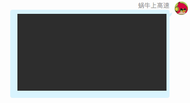
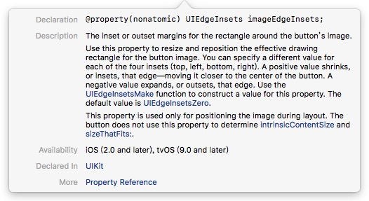

<h1>详解<span style = "color: red">UIButton</span>的<span style = "font-Size:24px; color: red">imageEdgeInsets</span>和<span  style = "font-Size:24px; color: red">titleEdgeInsets</span>属性</h1> 
***********
反复试验了两天，终于理解了*imageEdgeInsets*和*titleEdgeInsets*，首先我们看一下原理，针对content 水平、垂直居中的情况去分析，代码设置如下：

```objc
button.contentHorizontalAlignment = UIControlContentHorizontalAlignmentCenter;
button.contentVerticalAlignment = UIControlContentVerticalAlignmentCenter;

```
xib中按钮的设置如图：

效果如下,默认是左右排列，图片在左，文字在右


我们期许最后要有如下的效果：


<div style = "display = block; width:600px">首先引入<span style = "font-style:italic; color: blue; font-Size:24px">padding</span>这个概念，CSS用到的多，比如下左的聊天气泡，其实就是黑色框距离蓝色气泡的位置，下右的图片是CSS里的各种定义，这里我们只需要知道padding 往中心偏移的为正，从中心向外都为负</div>



针对右上的最中心的蓝色矩形来说（针对父容器绿色矩形）
> * padding-top: 20px; 
> * padding-left: 20px;
> * padding-bottom: 20px;
> * padding-right: 20px

当然，给负值的一侧就会超出父容器
**接下来说正事**
按钮中的image，如果我们想让它相对于原来的位置向右移动20，向上移动10，那么这里父容器就是原来image的位置，新的位置上下左右移动的位置都是相对于父容器，如图，实线的矩形表示原来按钮中image的位置，虚线的矩形表示，我们移动后的位置
> * top: -10px; 相对于原来**top-border**是背离中心(红色圆形)方向即向外扩张
> * bottom: 10px; 相对于原来**bottom-border**是靠近中心(红色圆形)方向即向内收缩
> * left: 20px; 相对于原来**left-border**是靠近中心(红色圆形)方向即向内收缩
> * right: 20px; 相对于原来**right-border**是背离中心(红色圆形)方向即向外扩张
> 


以上的top、 left、 bottom、 right就是我们将要设置的，我们打开一个工程去试验一下

```objc
-(void)viewWillLayoutSubviews{
    [super viewWillLayoutSubviews];
  
    [self.button setImageEdgeInsets:UIEdgeInsetsMake(-10, 20, 10, 20)];
}

```


确定是相对于原来的位置移动的，我们看一下**setImageEdgeInsets**这个方法的描述


当然我的经验是按钮大小确定以后去设置，不会有问题。


####以上是原理，我们在实际开发的时候使用一下，我们先看一个简单图左文右的


在image和label中插入一个space，红色虚线为button 的 content(虚线部分，image + label)，水平垂直都是居中模式，若中间插入一个space，还想保持居中，需要imgae左移半个space，label右移半个space，则content还是居中的，根据上面的分析，image新的位置相对之前的位置left向外扩张(space / 2.0)px，right向内收缩(space / 2.0)px，上下没有动，则
####image
> * left: -10px;
> * right: 10px;
> * top: 0px;
> * bottom: 0px;

####同理label
> * left: 10px;
> * right: -10px;
> * top: 0px;
> * bottom: 0px;

 
####再看一个文上图下排列的


分析一下，如果还要保持content(虚线部分，image + label)居中，对于上下来说，image是向下移动半个label的高度 + 半个space的高度，label向上移动半个image高度 + 半个space的高度；对于左右来说，如下图，image右移动了半个content宽度减去半个image宽度 即 <span style = "font-Size:18px; color: blue">(imageWidth + labelWidth) / 2.0 - imageWidth / 2.0</span>如下图


这样我们拿到button中的image和label的宽高即可，这里注意下label 宽高的获取方式

```ojbc
    //    获取按钮图片的宽高
    CGFloat imageWidth = button.imageView.frame.size.width;
    CGFloat imageHeight = button.imageView.frame.size.height;
    
    //    获取文字的宽高
    CGFloat labelWidth = button.titleLabel.frame.size.width;
    CGFloat labelHeight = button.titleLabel.frame.size.height;
    
    //    IOS8之后获取按钮文字的宽高
    if ([[[UIDevice currentDevice] systemVersion] floatValue] >= 8.0) {
        CGSize labelSize = button.titleLabel.intrinsicContentSize;
        labelWidth = labelSize.width;
        labelHeight = labelSize.height;
    }

```

####那么我们封装一个类，方便使用，这里我扩展了一个button (PlaceContent)

```objc
#import <UIKit/UIKit.h>
typedef NS_ENUM(NSInteger, ZYButtonImagePosition) {
    
    ZYButtonImagePositionLeft,
    ZYButtonImagePositionRight,
    ZYButtonImagePositionTop,
    ZYButtonImagePositionBottom
};

@interface UIButton (PlaceContent)

/**
 重新摆放按钮的image和label  注意调用时机，按钮的大小确定之后再去调用

 @param position 图片的位置
 @param space 图片和文字之间的距离
 */
-(void)placeImageTitlePosition:(ZYButtonImagePosition)position space:(CGFloat)space;

@end
```

```objc
#import "UIButton+PlaceContent.h"

@implementation UIButton (PlaceContent)

-(void)placeImageTitlePosition:(ZYButtonImagePosition)position space:(CGFloat)space{
//    self.contentHorizontalAlignment = UIControlContentHorizontalAlignmentCenter;
//    self.contentVerticalAlignment = UIControlContentVerticalAlignmentCenter;
    
    //    获取按钮图片的宽高
    CGFloat imageWidth = self.imageView.frame.size.width;
    CGFloat imageHeight = self.imageView.frame.size.height;
    
    //    获取文字的宽高
    CGFloat labelWidth = self.titleLabel.frame.size.width;
    CGFloat labelHeight = self.titleLabel.frame.size.height;
    
    //    IOS8之后获取按钮文字的宽高
    if ([[[UIDevice currentDevice] systemVersion] floatValue] >= 8.0) {
        CGSize labelSize = self.titleLabel.intrinsicContentSize;
        labelWidth = labelSize.width;
        labelHeight = labelSize.height;
    }
    
    NSLog(@"按钮图片 width: %f  height: %f \n", imageWidth, imageHeight);
    
    NSLog(@"按钮文字 width: %f  height: %f \n", labelWidth, labelHeight);
    
    NSLog(@"按钮大小 width: %f  height: %f \n", self.frame.size.width, self.frame.size.height);
    
    //按钮图片文字的位置 EdgeInsets 都是相对原来的位置变化  类似于CSS 里的padding 往内侧方向是正
    CGFloat titleTop, titleLeft, titleBottom, titleRight;
    CGFloat imageTop, imageLeft, imageBottom, imageRight;
    
    switch (position) {
        case ZYButtonImagePositionLeft:
            //    图片在左、文字在右;
            imageTop = 0;
            imageBottom = 0;
            imageLeft =  -space / 2.0;
            imageRight = space / 2.0;
            
            titleTop = 0;
            titleBottom = 0;
            titleLeft = space / 2;
            titleRight = -space / 2;
            break;
            
        case ZYButtonImagePositionTop://    图片在上，文字在下
            imageTop = -(labelHeight / 2.0 + space / 2.0);//图片上移半个label高度和半个space高度  给label使用
            imageBottom = (labelHeight / 2.0 + space / 2.0);
            imageLeft = labelWidth / 2.0;
            imageRight = -labelWidth / 2.0f;
            
            titleLeft = -imageWidth / 2.0;
            titleRight = imageWidth / 2.0;
            titleTop = imageHeight / 2.0 + space / 2.0;//文字下移半个image高度和半个space高度
            titleBottom = -(imageHeight / 2.0 + space / 2.0);
            break;
            
        case ZYButtonImagePositionRight://    图片在右，文字在左
            imageTop = 0;
            imageBottom = 0;
            imageRight = -(labelWidth + space / 2.0);
            imageLeft = labelWidth + space / 2.0;
            
            titleTop = 0;
            titleLeft = -(imageWidth + space / 2.0);
            titleBottom = 0;
            titleRight = imageWidth + space / 2.0;
            break;
            
        case ZYButtonImagePositionBottom://    图片在下，文字在上
            imageLeft = (imageWidth + labelWidth) / 2.0 - imageWidth / 2.0;
            imageRight = -labelWidth / 2.0;
            imageBottom = -(labelHeight / 2.0 + space / 2.0);
            imageTop = labelHeight / 2.0 + space / 2.0;//图片下移半个label高度和半个space高度  给label使用
            
            titleTop = -(imageHeight / 2.0 + space / 2.0);
            titleBottom = imageHeight / 2.0 + space / 2.0;
            titleLeft = -imageWidth / 2.0;
            titleRight = imageWidth / 2.0;
            break;
        default:
            break;
    }
    
    self.imageEdgeInsets = UIEdgeInsetsMake(imageTop, imageLeft, imageBottom, imageRight);
    self.titleEdgeInsets = UIEdgeInsetsMake(titleTop, titleLeft, titleBottom, titleRight);

}
```

###看下最终执行结果


****
感谢您阅读完毕，如有疑问，欢迎添加QQ:<span style = "color: orange; font-Size:24px;">714387953</span>(蜗牛上高速)。
如果有错误，欢迎指正，一起切磋，共同进步
如果喜欢可以**Follow、Star、Fork**，都是给我最大的鼓励


